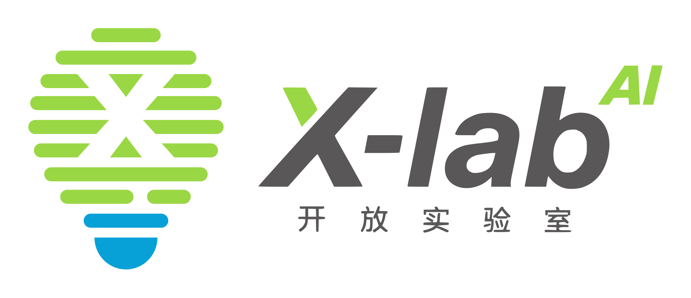
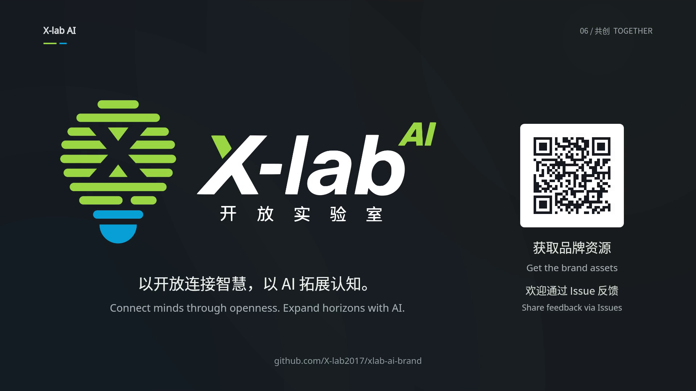
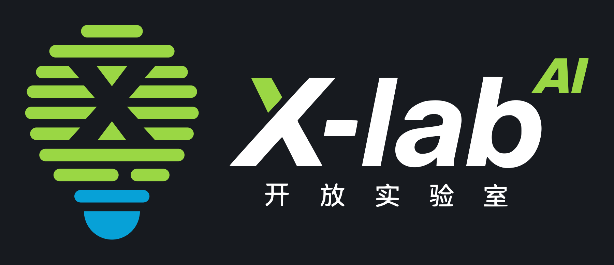
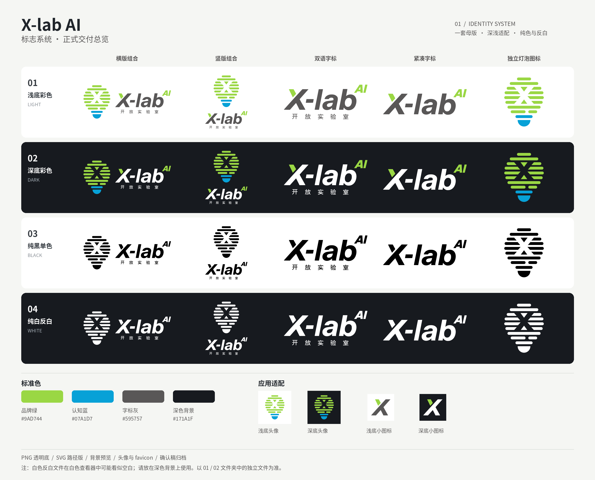

# X-lab AI · 品牌资源

**让 AI 成为认知升级的“指数”。**

X-lab AI 开放实验室品牌升级资源：正式 Logo、数字端基础适配、使用说明，以及公众号文章与配图。标志中的 **AI 位于 X-lab 右上角**，保持指数式上标关系。



## 《指数点亮》品牌短片已发布

**[在 B 站观看横屏版｜BV1dSHD64ETB](https://www.bilibili.com/video/BV1dSHD64ETB)**

[](https://www.bilibili.com/video/BV1dSHD64ETB)

两版均为 **45 秒、1080p、30 fps**，重点文字中英双语呈现，全程背景音乐、无旁白。横版舒展展示，竖版上下展开，保持同一套品牌视觉、叙事与配乐。横屏版已由维护者发布到 B 站。

| 成果 | 下载 / 查看 |
| --- | --- |
| 横版 · 1920 × 1080 | [下载 MP4](downloads/xlab-ai-film-landscape-1080p.mp4?raw=1) |
| 竖版 · 1080 × 1920 | [下载 MP4](downloads/xlab-ai-film-portrait-1080p.mp4?raw=1) |
| 完整制作文件包 v1.0 | [下载 ZIP](downloads/xlab-ai-film-production-v1.0.zip?raw=1) |
| 制作文案、配乐、素材、字体许可与渲染代码 | [浏览制作文件](media/brand-film/) · [制作说明](media/brand-film/README.txt) |
| 制作与发布过程、反馈 | [Issue #2](https://github.com/X-lab2017/xlab-ai-brand/issues/2) |

欢迎通过 Issue 分享播放体验、使用场景及改进建议；反馈时请注明横/竖版、时间点和播放设备。

## 品牌展示网站

网站提供品牌理念、深浅背景 Logo 交互预览、短片在线播放与素材下载。源文件位于 [`site/`](site/)。

首次发布：在仓库 **Settings → Pages → Build and deployment → Source** 选择 **GitHub Actions**。之后修改 `site/` 并提交到 `main` 即可自动更新网站。

发布成功后的默认地址：`https://x-lab2017.github.io/xlab-ai-brand/`。部署状态见 [Pages 工作流](https://github.com/X-lab2017/xlab-ai-brand/actions/workflows/pages.yml)。

## 从品牌走向行动：AI 普惠宣言

**让 AI 用得起，更用得好。** X-lab AI 普惠行动已发布，作为实验室的长期愿景与行动承诺。

[在线阅读宣言](https://www.x-lab.info/ai-for-all/) · [行动仓库](https://github.com/X-lab2017/ai-for-all) · [参与公开共建](https://github.com/X-lab2017/ai-for-all/issues/1)

## 下载与选用

**[下载全套 Logo（v1.0 ZIP）](downloads/xlab-ai-logo-v1.0.zip?raw=1)** · **[下载公众号素材（v1.1 ZIP）](downloads/xlab-ai-wechat-kit-v1.1.zip?raw=1)**

[按结构和背景选择单个文件](ASSET_INDEX.md) · [使用规范](BRAND_GUIDELINES.md) · [公众号文章](media/Xlab_AI_公众号发布素材/01_公众号发布稿.md)

Logo 下载包保留原始交付内容；公众号素材包 v1.1 已在文章中补入仓库与下载链接，v1.0 归档仍保留在 downloads 目录。需要单个文件时，请打开文件索引。使用正式 SVG 或透明 PNG，不要从总览图、草图或历史设计稿截图。

| 需求 | 选择 |
| --- | --- |
| 白色、浅色背景 | ColorLight：彩色图形 + 深灰字标 |
| 深色背景 | ColorDark：彩色图形 + 白色字标 |
| 单色制作 | MonoBlack / MonoWhite |
| 排版、放大 | SVG 路径母版 |
| 演示文稿、网页、文章配图 | PNG；需要叠加时选透明底文件 |
| 社交头像、网站小图标 | 专用头像 / favicon |

## 深浅背景均有对应版本



五种结构：横版、竖版、双语字标、紧凑字标、独立灯泡图标。四种配色：浅底彩色、深底彩色、纯黑、纯白。共 **20 个正式配置**，各配有 SVG、透明 PNG 和背景预览；另含头像与 favicon。



## 文件结构

```text
brand/Xlab_AI_Logo_System_v1.0/
  01_PNG_透明底/          正式透明 PNG
  02_SVG_矢量描摹/        正式 SVG 路径母版
  03_背景预览/            自带深浅背景的预览
  04_应用图标/            头像与 favicon
  05_确认稿与历史素材/    仅供溯源，不作生产母版
media/Xlab_AI_公众号发布素材/
  01_公众号发布稿.md      最新 Markdown 稿
  02_公众号发布稿.txt     最新纯文本稿
  配图/                   三张正式配图
media/brand-film/         短片制作文件、配乐、字体许可与片尾静帧
preview/                  首页展示图
downloads/               Logo、最新公众号素材、历史归档与校验文件
```

## 品牌使用

保留 AI 的右上角位置，保持原始比例、色值与安全留白；完整标志保留“开放实验室”。请阅读 [使用规范](BRAND_GUIDELINES.md) 与 [原始交付说明](brand/Xlab_AI_Logo_System_v1.0/00_使用说明.md)。

本仓库整理未新增或变更原素材的许可条款，也没有自动套用 MIT、CC0 等许可；许可相关说明见 [NOTICE.md](NOTICE.md)。

## 版本与维护

当前 Logo 资产版本：**v1.0**；公众号素材包：**v1.1**；短片版本：**v1.0**；仓库资源版本：**v1.1.0**。

[更新记录](CHANGELOG.md) · [文件校验清单](MANIFEST.json) · [供公众号文末使用的资源说明](docs/wechat-download-copy.md)

反馈文件缺失、显示问题或提出新适配需求时，请通过本仓库 Issues 说明使用场景。
